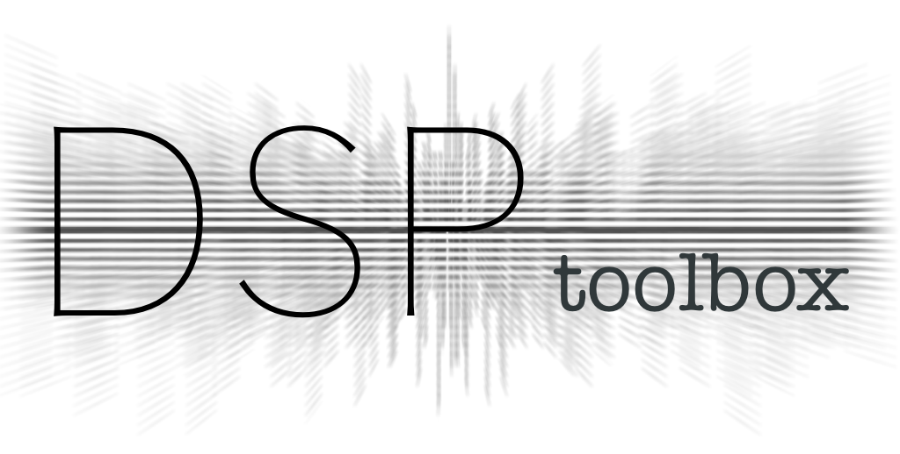

------------------------------------------------------------------------------

.. image:: https://readthedocs.org/projects/dsptoolbox/badge/?version=latest
    :target: https://dsptoolbox.readthedocs.io/en/latest/?badge=latest
    :alt: Documentation Status

.. image:: https://img.shields.io/pypi/l/dsptoolbox?color=gr
    :target: https://en.wikipedia.org/wiki/MIT_License
    :alt: License

.. image:: https://img.shields.io/pypi/pyversions/dsptoolbox
    :target: https://www.python.org/downloads/release/python-3100/
    :alt: Python version

.. image:: https://img.shields.io/pypi/v/dsptoolbox?color=orange
    :target: https://pypi.org/project/dsptoolbox/
    :alt: PyPI version

Readme
======

This is a toolbox in form of a python package that contains algorithms to be used in dsp (digital signal processing) research projects.

This is kind of a "sandbox" project with many different experimental implementations across a variety of DSP-related topics. Some parts are more
thoroughly tested and validated than others, so "caution" is advised. Please feel free to reach out in case you find bugs or want
to talk about certain functionality.

It is under active development and it will take some time until it reaches a certain level of maturity. Beware that backwards compatibility is not an actual concern and significant
changes to the API might come in the future. If you find some implementations interesting or useful, please feel free to use it for your projects
and expand or change functionalities.

Getting Started
===============

Refer to the `documentation`_ for the complete description of classes and
functions.

.. code-block:: python

    import dsptoolbox as dsp

    signal = dsp.Signal.from_file("recording.wav")
    signal = signal.set_spectrum_parameters(method=dsp.SpectrumMethod.FFT)
    frequencies_hz, spectrum = signal.get_spectrum()

    lowpass = dsp.Filter.iir_filter(
        order=8,
        frequency_hz=2000.0,
        type_of_pass=dsp.FilterPassType.Lowpass,
        sampling_rate_hz=signal.sampling_rate_hz,
    )
    filtered = lowpass.filter_signal(signal)
    filtered.plot_magnitude()
    dsp.plots.show()

Installation
============

Use pip to install dsptoolbox

.. code-block:: console

    $ pip install dsptoolbox

    # Or this for activating numba parallelization
    $ pip install "dsptoolbox[use-numba]"

(Requires Python 3.11 or higher)

On Linux, install the native audio libraries used by the audio dependencies
manually. `sounddevice`_ uses PortAudio for live audio input and output, while
`soundfile`_ uses libsndfile for reading and writing audio files. Install them
with the following command:

.. code-block:: console

    $ sudo apt-get install libasound2 libportaudio2 libsndfile1

If this does not work properly for some reason, refer to the documentation for
`sounddevice`_, `soundfile`_, or `PortAudio`_.

.. _documentation: http://dsptoolbox.readthedocs.io/
.. _sounddevice: https://python-sounddevice.readthedocs.io/en/0.4.5/
.. _soundfile: https://python-soundfile.readthedocs.io/
.. _PortAudio: http://www.portaudio.com
